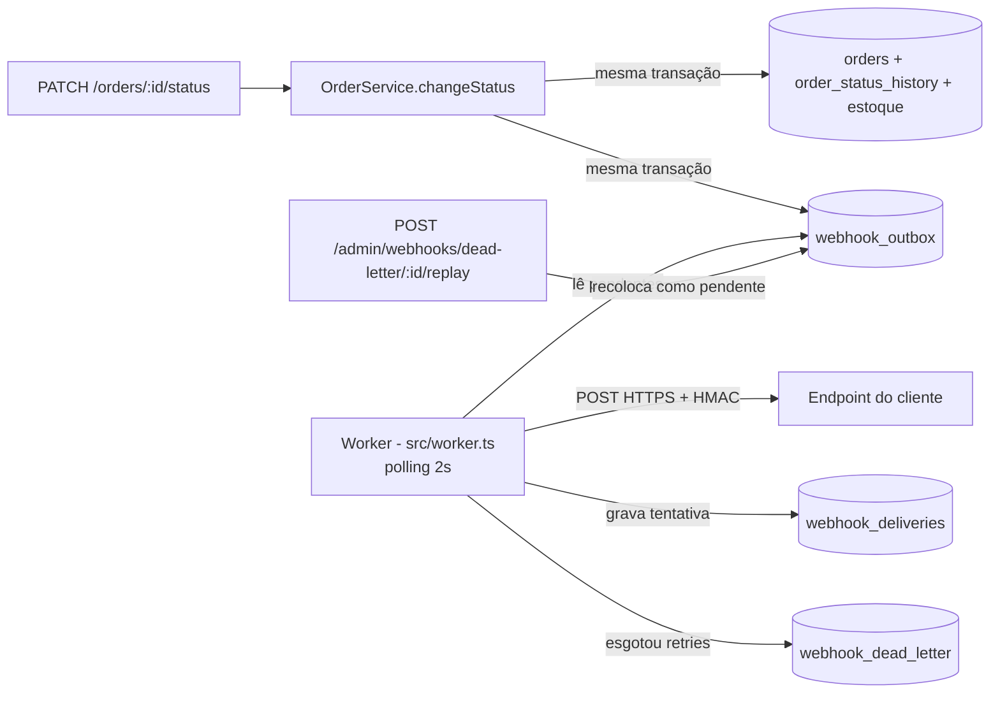

# RFC — Sistema de Webhooks de Notificação de Pedidos

| Campo | Valor |
|---|---|
| **Autor** | Lucas Kretschmer (a partir da reunião técnica conduzida por Larissa) |
| **Status** | Em revisão |
| **Data** | 2026-10-07 |
| **Revisores** | Larissa (Tech Lead), Marcos (PM), Bruno (Eng. Pedidos), Diego (Eng. Plataforma), Sofia (Segurança) |
| **Documentos relacionados** | [PRD](PRD.md) · [FDD](FDD.md) · [ADRs](adrs/README.md) · [Tracker](TRACKER.md) |

## 1. Resumo (TL;DR)

Propomos notificar clientes B2B sobre mudanças de status de pedido via **webhooks outbound**. A mudança de status grava um evento numa **tabela outbox no MySQL**, na mesma transação do pedido. Um **worker em processo separado** lê a outbox a cada 2 s e faz o POST no endpoint do cliente, **assinado com HMAC-SHA256** (secret por endpoint). Falhas entram em **retry com backoff** (1m/5m/30m/2h/12h) e, esgotadas, vão para uma **DLQ** com replay manual por admin. A entrega é **at-least-once**, com `X-Event-Id` para o cliente deduplicar. Tudo dentro dos padrões atuais do projeto, sem infraestrutura nova.

## 2. Contexto e problema

Atlas Comercial, MaxDistribuição e Nova Cargo pediram formalmente para ser notificados em tempo real sobre mudanças de status dos seus pedidos. Hoje eles fazem polling em `GET /orders`, o que deixa a integração lenta e cara; a Atlas sinalizou que pode migrar para um concorrente se não tiver isso até o fim do trimestre [09:00 Marcos]. Para eles, "tempo real" é abaixo de 10 segundos [09:02 Marcos].

O OMS não tem hoje nenhum mecanismo de evento, fila ou notificação externa. A mudança de status é feita em `OrderService.changeStatus` (`src/modules/orders/order.service.ts`) dentro de uma transação que já atualiza o pedido, grava o histórico e mexe no estoque [09:04 Bruno]. Qualquer solução tem que:

- não adicionar latência nem pontos de falha externos a essa transação;
- nunca perder um evento de um status que mudou, nem emitir evento de um status que deu rollback;
- ser operável por um time pequeno, sem nova infraestrutura [09:07 Diego].

## 3. Proposta técnica

### 3.1 Visão geral

### 3.2 Componentes

1. **Cadastro de webhooks** — API REST autenticada para o cliente (via usuários do OMS que o representam) cadastrar URL `https` e a lista de status que quer ouvir. A secret é gerada pela plataforma e pode ser rotacionada.
2. **Publicação do evento (outbox)** — `changeStatus` chama `publishWebhookEvent(tx, ...)`, que grava na outbox um snapshot do payload para cada webhook ativo que assina o novo status. Falha nessa gravação derruba a transação. ([ADR-001](adrs/ADR-001-outbox-no-mysql.md), [ADR-007](adrs/ADR-007-snapshot-do-payload-e-filtro-na-insercao.md))
3. **Worker de entrega** — processo Node separado, com Prisma próprio, uma única instância, lendo pendentes por ordem de criação a cada 2 s. ([ADR-002](adrs/ADR-002-worker-separado-em-polling.md))
4. **Retry e DLQ** — timeout de 10 s; até 5 retentativas com backoff; depois, DLQ em tabela própria e replay manual restrito a `ADMIN`. ([ADR-003](adrs/ADR-003-retry-com-backoff-e-dlq.md))
5. **Segurança** — HMAC-SHA256 sobre o corpo, secret por endpoint, rotação com 24 h de convivência, TLS obrigatório, limite de 64 KB de payload. ([ADR-004](adrs/ADR-004-hmac-sha256-com-secret-por-endpoint.md))
6. **Semântica de entrega** — at-least-once, `X-Event-Id` estável entre retentativas. ([ADR-005](adrs/ADR-005-at-least-once-com-x-event-id.md))
7. **Histórico de entregas** — o cliente consulta as últimas entregas (status, payload, resposta, tempo de resposta).

Tudo segue os padrões do código atual: módulo em `src/modules/webhooks`, erros com prefixo `WEBHOOK_` herdando de `AppError`, Pino, `errorMiddleware` e `requireRole` existentes ([ADR-006](adrs/ADR-006-reuso-dos-padroes-do-projeto.md)).

Contratos, schema de tabelas, fluxos detalhados e matriz de erros estão no [FDD](FDD.md).

## 4. Alternativas consideradas

| ID | Alternativa | Trade-off que levou ao descarte |
|---|---|---|
| RFC-ALT-01 | **Disparo HTTP síncrono dentro de `changeStatus`** | Simples, mas um cliente lento travaria mudanças de status de outros pedidos, e cliente fora do ar forçaria a escolher entre rollback do status ou perder o evento [09:04 Bruno, 09:06 Diego]. |
| RFC-ALT-02 | **Redis Streams / fila dedicada** | Daria mais reatividade e escala, mas exige subir e operar infra nova (Redis Cluster) para um time pequeno; foi considerado overengineering [09:07 Larissa, 09:07 Diego]. |
| RFC-ALT-03 | **Trigger do MySQL para acordar o worker** | Seria mais reativo que polling, mas MySQL não tem `LISTEN/NOTIFY`; trigger não avisa processo externo e exigiria gambiarra. Polling de 2 s já atende o requisito de < 10 s [09:09 Bruno, 09:09 Diego]. |
| RFC-ALT-04 | **Exactly-once** | Melhor experiência para o cliente, mas exige coordenação dos dois lados e muito mais complexidade [09:25 Diego]. |
| RFC-ALT-05 | **Retry indefinido ou só 3 tentativas** | Indefinido deixa evento pendurado para sempre; 3 tentativas cobrem só ~30 min e não aguentam uma manutenção de 2 h de cliente [09:15 Diego, 09:16 Diego]. |
| RFC-ALT-06 | **Secret global da plataforma** | Mais simples de gerenciar, mas um vazamento comprometeria todos os clientes [09:21 Sofia]. |

## 5. Questões em aberto

| ID | Questão | Origem | Encaminhamento proposto |
|---|---|---|---|
| RFC-QA-01 | **Rate limiting de saída** por cliente (ex.: 50 mudanças em 1 minuto = 50 chamadas). | [09:38 Diego], [09:39 Larissa] | Fora do escopo; observar volume em produção e decidir depois. |
| RFC-QA-02 | **Escalar para múltiplos workers** sem perder ordenação por pedido (particionar por `order_id` ou lock pessimista). | [09:13 Diego] | Fica para o futuro; hoje é single-worker como limitação conhecida. |
| RFC-QA-03 | **Aviso ao cliente quando o webhook falha** repetidamente (e-mail). | [09:37 Marcos], [09:37 Larissa] | Próxima fase, depois de medir impacto. |
| RFC-QA-04 | **Arquivamento** das linhas entregues da outbox (~30 dias). | [09:08 Diego] | Fora desta feature; precisa entrar no backlog. |
| RFC-QA-05 | **Endurecer permissões** do CRUD de webhooks (hoje qualquer role autenticada). | [09:37 Sofia] | Revisitar depois do lançamento. Ver também RFC-RISK-04. |
| RFC-QA-06 | **"5 tentativas" = 5 envios ou 5 retentativas?** | [09:17 Diego], [09:48 Larissa] | Adotamos 1 envio + 5 retentativas; explicação no [ADR-003](adrs/ADR-003-retry-com-backoff-e-dlq.md). Confirmar com Diego/Larissa. |
| RFC-QA-07 | **Ordenação por pedido durante retry**: se o evento PAID está esperando retry e o PROCESSING do mesmo pedido entra depois, o worker manda PROCESSING antes? | [09:12 Diego], [09:17 Larissa] | Proposta: aceitar como parte da limitação de ordering e documentar no portal que o cliente deve usar o `timestamp` do payload. Bloquear a fila por pedido fica como alternativa a discutir. |
| RFC-QA-08 | **`customer_id` no body ou no path** dos endpoints de cadastro. | [09:32 Larissa] | Proposta: body no cadastro e query string na listagem (*proposta*: a reunião só citou body ou path), igual a `customerId` em `src/modules/orders/order.schemas.ts`. |

## 6. Impacto e riscos

**Impacto no sistema existente**
- `changeStatus` ganha leitura dos webhooks do customer e inserts na outbox dentro da transação (pequeno aumento de duração).
- Novo processo para deploy e operação (`npm run worker`).
- Quatro tabelas novas no MySQL e uma migration Prisma.
- Nenhuma mudança de contrato nas APIs existentes.

**Riscos**

| ID | Risco | Prob. | Impacto | Mitigação |
|---|---|---|---|---|
| RFC-RISK-01 | Não entregar até fim de novembro e perder a Atlas [09:00 Marcos, 09:45 Marcos] | Média | Alto | Estimativa de 3 sprints com revisão de segurança incluída [09:46 Larissa, 09:47 Larissa]. |
| RFC-RISK-02 | Worker parado acumula eventos (ponto único de falha) | Média | Médio | Eventos não se perdem (outbox); alertar sobre backlog de pendentes. |
| RFC-RISK-03 | Cliente não deduplica e processa evento duas vezes | Média | Médio | `X-Event-Id` + documentação destacada no portal [09:26 Marcos]. |
| RFC-RISK-04 | Qualquer usuário autenticado pode gerenciar webhooks de qualquer customer: no código, `User` não tem vínculo com `Customer` (`prisma/schema.prisma`) | Média | Alto | Aceito nesta fase [09:37 Sofia]; levado à revisão de segurança. |
| RFC-RISK-05 | Vazamento de secret pelo cliente | Baixa | Alto | Secret por endpoint e rotação com grace period [09:21 Sofia, 09:22 Diego]. |
| RFC-RISK-06 | Crescimento da outbox sem arquivamento | Alta (no longo prazo) | Médio | Índices em `status`/`created_at` [09:08 Diego]; arquivamento no backlog (RFC-QA-04). |

## 7. Decisões relacionadas

- [ADR-001 — Padrão Outbox no MySQL](adrs/ADR-001-outbox-no-mysql.md)
- [ADR-002 — Worker separado em polling de 2 s](adrs/ADR-002-worker-separado-em-polling.md)
- [ADR-003 — Retry com backoff e DLQ](adrs/ADR-003-retry-com-backoff-e-dlq.md)
- [ADR-004 — HMAC-SHA256 com secret por endpoint](adrs/ADR-004-hmac-sha256-com-secret-por-endpoint.md)
- [ADR-005 — At-least-once com X-Event-Id](adrs/ADR-005-at-least-once-com-x-event-id.md)
- [ADR-006 — Reuso dos padrões do projeto](adrs/ADR-006-reuso-dos-padroes-do-projeto.md)
- [ADR-007 — Snapshot do payload e filtro na inserção](adrs/ADR-007-snapshot-do-payload-e-filtro-na-insercao.md)
